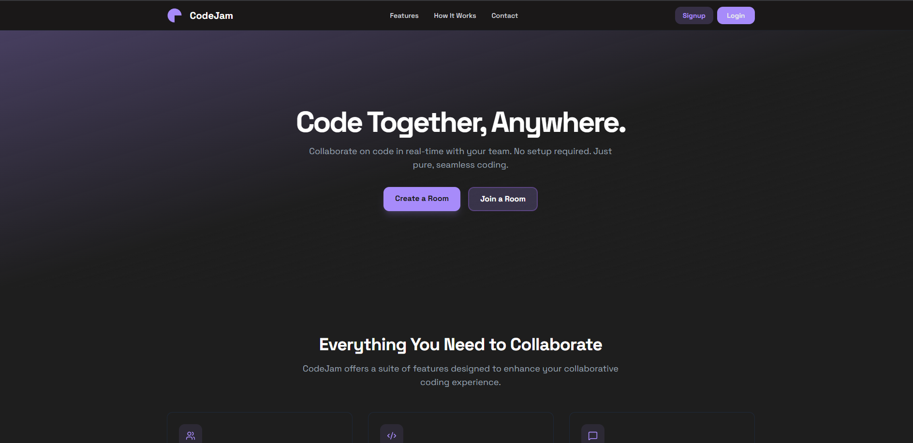
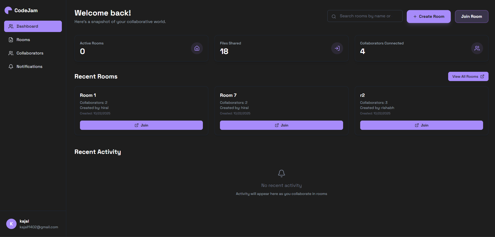
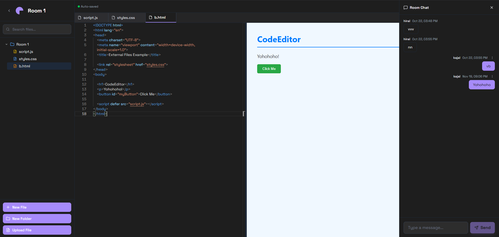

# 🚀 CodeJam: Real-time Collaborative Code Editor

---
CodeJam is a real-time collaborative code editor that runs entirely in the browser. It lets multiple users work together on code, share files, chat, and manage rooms — all inside a fast and modern workspace. With live collaboration, a built-in file explorer, and integrated code execution, CodeJam makes team coding, learning, and project work seamless. 
---

## ✨ Key Features

* **Real-time collaborative editing** and presence (multiple users in a room).
* **Chat** functionality and invitations to collaborate.
* **File explorer** and tabbed editor UI.
* **Integrated terminal** and **code execution** (server-side).
* User **authentication** and room management.

---

## 📂 Repository Structure

| Directory | Description | Technologies |
| :--- | :--- | :--- |
| `client/` | Frontend application | **React** + **Vite** + **Tailwind** |
| `server/` | Backend API and WebSocket server | **Node.js** + **Express** + **Socket.IO** |

---

## 🖼️ Screenshots

# Homepage 
|  

# Dashboard
 

# Room Editor
 

---

## 🛠️ Getting Started

### Prerequisites

* **Node.js** (v16+ recommended)
* `npm` or `Yarn`

### Quick Start (Development)

1.  **Clone the repository:**
    ```powershell
    git clone [https://github.com/kajal-1402-yadav/CodeJam.git](https://github.com/kajal-1402-yadav/CodeJam.git)
    cd CodeJam
    ```

2.  **Install and run the server** (Backend):
    ```powershell
    cd server
    npm install
    npm run dev
    ```
    > **Note:** The server API runs by default on `http://localhost:3000` (or another port if configured).

3.  **Install and run the client** (Frontend - *in a new terminal*):
    ```powershell
    cd client
    npm install
    npm run dev
    ```
    > **Access:** Open the app in your browser at the address shown by the client dev server (usually `http://localhost:5173`).
